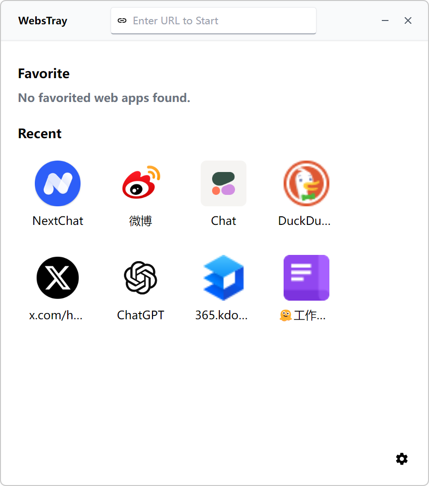
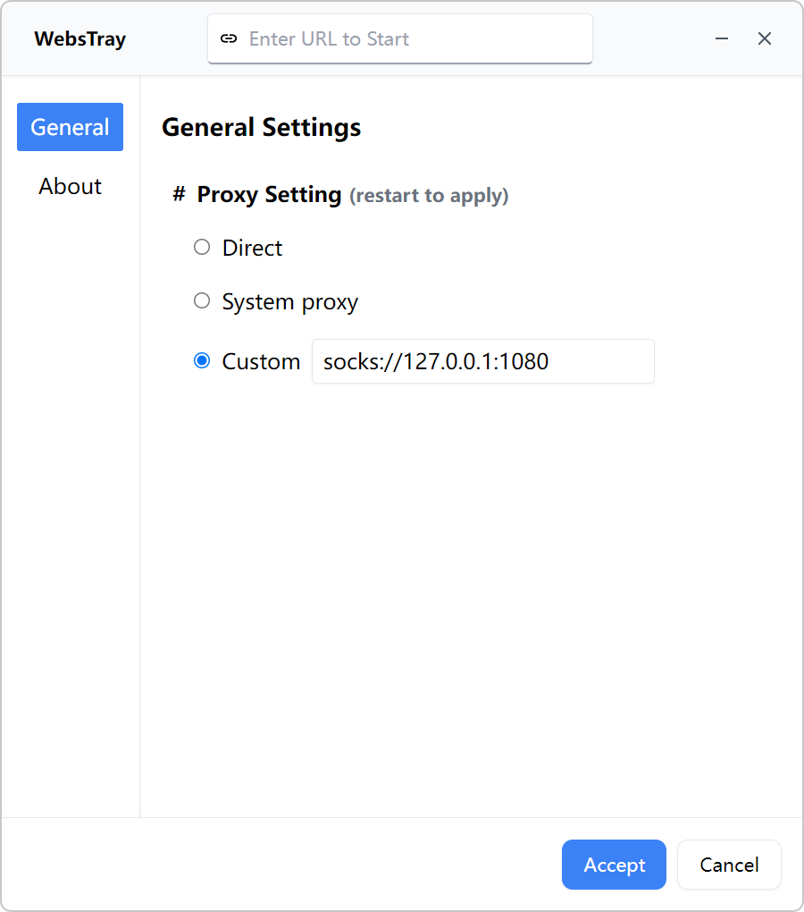
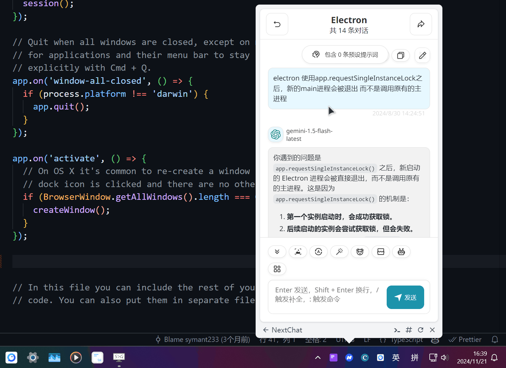

# WebsTray

<p align="center">
  
</p>

Inspired by _WebStay_. **WebsTray** allows you to pin any web apps to system tray.

Download latest production installer: [releases](https://github.com/symant233/WebsTray/releases/latest).

<details>
  <summary>🎞️ Screenshots</summary>

  <p align="center">
    
    
  </p>

  <p align="center">
    
  </p>
</details>

## Features

- Opensource, free to use or modify.
- System proxy and custom local proxy are supported.
- Remember tray window size (handle resize event).
- Screen offset when tray window overflow.

## Develop References

```bash
npm run dev # start dev application

npm run package # package into a platform-specific executable bundle
npm run make # make distributables (installer)
```

- https://www.electronforge.io/
- https://gist.github.com/kryparnold/67007bb83228aa20fb0b8b3656b23a79
- https://www.electronjs.org/zh/docs/latest/api/app
- https://www.electronjs.org/zh/docs/latest/api/tray
- https://www.electronjs.org/zh/docs/latest/api/menu-item
- https://www.electronjs.org/zh/docs/latest/api/webview-tag
- https://github.com/pmndrs/zustand
- https://materialdesignicons.com/
- http://lublank.com/2019/12/14/electron-proxy/
- https://www.electronjs.org/zh/docs/latest/api/session#sessetproxyconfig
- https://js.electronforge.io/interfaces/_electron_forge_maker_squirrel.InternalOptions.Options.html

APP Icon: [Figma/WebsTray](https://www.figma.com/design/ZU2hK5Z1rKUuyu092ukdga/WebsTray)

## License

> [GNU GENERAL PUBLIC LICENSE Version 3](./LICENSE)
